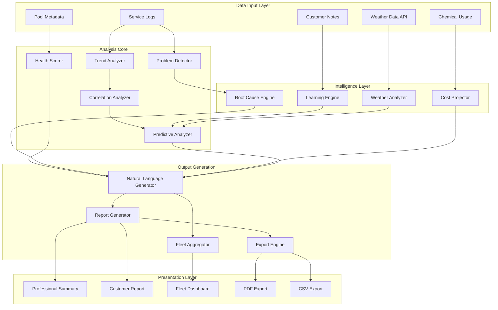

# AI Pool Summarizer - Design Document

## Overview

The AI Pool Summarizer transforms raw pool service data into intelligent, actionable insights through a multi-layered analysis engine. The system combines statistical trend analysis, pattern recognition, natural language generation, and predictive modeling to deliver summaries that help pool professionals make better decisions and communicate effectively with customers.

The architecture follows a pipeline pattern where raw service logs flow through analysis stages, each enriching the data with computed insights, before final assembly into various output formats (professional summaries, customer reports, fleet comparisons, exports).

## Architecture



## Components and Interfaces

### 1. PoolHealthScorer

Calculates the overall Pool Health Score (0-100) based on weighted chemical readings and trend data.

```typescript
interface PoolHealthScore {
  score: number;              // 0-100
  grade: 'A' | 'B' | 'C' | 'D' | 'F';
  breakdown: {
    chemical: string;
    score: number;
    weight: number;
    contribution: number;
  }[];
  trend: 'improving' | 'stable' | 'declining';
  confidence: number;         // 0-100
}

interface PoolHealthScorerConfig {
  weights: {
    ph: number;
    chlorine: number;
    alkalinity: number;
    stabilizer: number;
    salt: number;
  };
  trendWeight: number;        // How much trend affects score
  recencyBias: number;        // Weight recent readings more
}
```

### 2. PredictiveAnalyzer

Generates forecasts for future chemical behavior based on historical patterns.

```typescript
interface Prediction {
  chemical: string;
  currentLevel: string;
  predictedLevel: string;
  daysUntilCritical: number | null;
  confidence: number;         // 0-100
  factors: string[];          // What influenced this prediction
  recommendedAction: string | null;
}

interface PredictiveInsights {
  predictions: Prediction[];
  overallOutlook: 'stable' | 'attention-needed' | 'intervention-required';
  nextServiceRecommendation: {
    urgency: 'routine' | 'soon' | 'urgent';
    suggestedDate: string;
    reason: string;
  };
  seasonalFactors: string[];
  weatherFactors: string[];
}
```

### 3. RootCauseAnalyzer

Identifies underlying causes of recurring problems through chemical correlation analysis.

```typescript
interface ChemicalCorrelation {
  chemicals: [string, string];
  correlationType: 'positive' | 'negative' | 'causal';
  strength: number;           // 0-1
  description: string;
  implication: string;
}

interface RootCause {
  id: string;
  symptom: string;
  cause: string;
  confidence: number;
  evidence: string[];
  solution: {
    immediate: string;
    longTerm: string;
    equipmentCheck: string | null;
  };
  recurrenceCount: number;
}

interface RootCauseAnalysis {
  correlations: ChemicalCorrelation[];
  rootCauses: RootCause[];
  chronicIssues: {
    chemical: string;
    occurrences: number;
    pattern: string;
    suggestedInvestigation: string;
  }[];
}
```

### 4. NaturalLanguageGenerator

Transforms structured analysis data into human-readable summaries.

```typescript
interface SummaryOptions {
  audience: 'professional' | 'customer';
  verbosity: 'brief' | 'standard' | 'detailed';
  includeRecommendations: boolean;
  includeCosts: boolean;
  includeWeather: boolean;
}

interface GeneratedSummary {
  headline: string;           // One-line status
  paragraph: string;          // Full narrative summary
  bulletPoints: string[];     // Key takeaways
  callToAction: string | null;
  tone: 'positive' | 'neutral' | 'concerned' | 'urgent';
}

interface CustomerReport {
  greeting: string;
  healthSummary: string;
  whatWeDid: string[];
  whatToExpect: string;
  recommendations: string[];
  closingNote: string;
  shareableText: string;      // SMS/email friendly version
}
```

### 5. CostProjector

Forecasts chemical costs based on usage history and pool characteristics.

```typescript
interface CostProjection {
  period: string;             // e.g., "December 2025"
  estimate: {
    low: number;
    expected: number;
    high: number;
  };
  breakdown: {
    chemical: string;
    quantity: string;
    cost: number;
  }[];
  factors: string[];          // What influenced this projection
  comparedToAverage: 'below' | 'average' | 'above';
}

interface CostAnalysis {
  monthlyProjections: CostProjection[];
  annualEstimate: {
    low: number;
    expected: number;
    high: number;
  };
  costTrend: 'decreasing' | 'stable' | 'increasing';
  highMaintenanceFlag: boolean;
  savingsOpportunities: string[];
}
```

### 6. FleetAnalyzer

Aggregates analysis across multiple pools for business-level insights.

```typescript
interface FleetPool {
  customerId: string;
  customerName: string;
  healthScore: number;
  urgency: 'none' | 'low' | 'medium' | 'high' | 'critical';
  primaryIssue: string | null;
  serviceDay: string;
  lastService: string;
  daysSinceService: number;
}

interface FleetInsights {
  totalPools: number;
  averageHealthScore: number;
  healthDistribution: {
    excellent: number;        // 80-100
    good: number;             // 60-79
    fair: number;             // 40-59
    poor: number;             // 0-39
  };
  priorityPools: FleetPool[]; // Top 5 needing attention
  problemClusters: {
    issue: string;
    pools: string[];
    suggestedBatchAction: string;
  }[];
  byServiceDay: {
    day: string;
    poolCount: number;
    averageHealth: number;
    estimatedTime: number;    // minutes
  }[];
  alerts: {
    type: 'score-drop' | 'overdue' | 'chronic-issue';
    poolId: string;
    message: string;
  }[];
}
```

### 7. LearningEngine

Tracks intervention outcomes to improve recommendations over time.

```typescript
interface InterventionRecord {
  id: string;
  poolId: string;
  date: string;
  action: string;
  chemical: string;
  beforeReading: string;
  afterReading: string | null;
  success: boolean | null;
  source: 'note' | 'inferred';
}

interface LearnedPattern {
  condition: string;          // e.g., "low chlorine + high stabilizer"
  effectiveAction: string;
  successRate: number;
  sampleSize: number;
  confidence: number;
}

interface LearningInsights {
  interventions: InterventionRecord[];
  patterns: LearnedPattern[];
  recommendationAdjustments: {
    original: string;
    adjusted: string;
    reason: string;
  }[];
}
```

### 8. WeatherAnalyzer

Incorporates weather data into predictions and recommendations.

```typescript
interface WeatherForecast {
  date: string;
  condition: 'sunny' | 'cloudy' | 'rain' | 'storm';
  highTemp: number;
  lowTemp: number;
  precipitation: number;      // inches
  humidity: number;           // percentage
}

interface WeatherImpact {
  forecast: WeatherForecast[];
  impacts: {
    chemical: string;
    expectedEffect: string;
    severity: 'low' | 'medium' | 'high';
    preemptiveAction: string;
  }[];
  overallRisk: 'low' | 'moderate' | 'high';
  summary: string;
}
```

### 9. ExportEngine

Generates various export formats for reports and data.

```typescript
interface ExportOptions {
  format: 'pdf' | 'csv' | 'json';
  includeCharts: boolean;
  branding: {
    companyName: string;
    logo: string | null;
    primaryColor: string;
  } | null;
  dateRange: { start: string; end: string };
}

interface ExportResult {
  format: string;
  filename: string;
  data: Blob | string;
  generatedAt: string;
  dataRange: { start: string; end: string };
}
```

## Data Models

### PoolAnalysisResult (Enhanced)

```typescript
interface PoolAnalysisResult {
  // Identification
  customerId: string;
  customerName: string;
  poolType: string;
  poolGallons: number | null;
  analysisDate: string;
  dataRange: { start: string; end: string };
  totalServices: number;

  // Core Scores
  healthScore: PoolHealthScore;
  
  // Trends & Patterns
  chemicalTrends: ChemicalTrend[];
  overallTrend: 'improving' | 'stable' | 'declining';
  
  // Problems & Root Causes
  problems: PoolProblem[];
  rootCauseAnalysis: RootCauseAnalysis;
  
  // Predictions
  predictiveInsights: PredictiveInsights;
  weatherImpact: WeatherImpact | null;
  
  // Costs
  costAnalysis: CostAnalysis | null;
  
  // Generated Content
  professionalSummary: GeneratedSummary;
  customerReport: CustomerReport;
  
  // Recommendations
  recommendations: {
    immediate: Recommendation[];
    thisVisit: Recommendation[];
    nextVisit: Recommendation[];
    longTerm: Recommendation[];
  };
  
  // Learning
  learningInsights: LearningInsights | null;
  
  // Metadata
  confidence: number;
  dataQuality: 'excellent' | 'good' | 'fair' | 'limited';
  generatedAt: string;
}

interface Recommendation {
  id: string;
  priority: number;           // 1 = highest
  action: string;
  reason: string;
  chemical: string | null;
  dosage: string | null;      // e.g., "2 lbs per 10,000 gallons"
  equipmentCheck: string | null;
  addressesIssue: string;
  preventsFuture: boolean;
}
```

## Correctness Properties

*A property is a characteristic or behavior that should hold true across all valid executions of a system-essentially, a formal statement about what the system should do. Properties serve as the bridge between human-readable specifications and machine-verifiable correctness guarantees.*

### Property 1: Health Score Bounds
*For any* pool analysis with valid service logs, the Pool_Health_Score SHALL be a number between 0 and 100 inclusive, and the grade SHALL correctly correspond to the score range (A: 80-100, B: 60-79, C: 40-59, D: 20-39, F: 0-19).
**Validates: Requirements 1.2**

### Property 2: Health Score Monotonicity with Chemical Quality
*For any* two pools where one has all 'good' readings and another has mixed readings, the pool with all 'good' readings SHALL have a higher or equal health score.
**Validates: Requirements 1.2, 1.3**

### Property 3: Prediction Confidence Bounds
*For any* prediction generated by the AI_Pool_Summarizer, the confidence value SHALL be between 0 and 100 inclusive.
**Validates: Requirements 2.4**

### Property 4: Insufficient Data Detection
*For any* pool with fewer than 3 service logs, the AI_Pool_Summarizer SHALL set dataQuality to 'limited' and confidence below 50.
**Validates: Requirements 1.5**

### Property 5: Prediction Requires Minimum Data
*For any* pool with fewer than 5 service logs, the AI_Pool_Summarizer SHALL NOT generate predictions with confidence above 60%.
**Validates: Requirements 2.1, 2.5**

### Property 6: Chronic Issue Detection Threshold
*For any* chemical that shows the same problem (low/high/critical) in more than 3 service logs, the AI_Pool_Summarizer SHALL flag it as a chronic issue.
**Validates: Requirements 3.2**

### Property 7: Cost Projection Range Ordering
*For any* cost projection, the low estimate SHALL be less than or equal to expected, and expected SHALL be less than or equal to high.
**Validates: Requirements 5.4**

### Property 8: Recommendation Priority Ordering
*For any* set of recommendations, immediate recommendations SHALL have lower priority numbers (higher urgency) than long-term recommendations.
**Validates: Requirements 6.1, 6.2**

### Property 9: Fleet Health Score Consistency
*For any* fleet analysis, the average health score SHALL equal the sum of individual pool health scores divided by the number of pools.
**Validates: Requirements 7.1**

### Property 10: Summary Generation Completeness
*For any* valid pool analysis, the generated summary SHALL contain a non-empty headline, paragraph, and at least one bullet point.
**Validates: Requirements 1.1, 4.1**

### Property 11: Customer Report Tone Appropriateness
*For any* pool with health score below 40, the customer report tone SHALL be 'concerned' or 'urgent', not 'positive'.
**Validates: Requirements 4.2, 4.3**

### Property 12: Export Timestamp Accuracy
*For any* export, the generatedAt timestamp SHALL be within 1 minute of the actual generation time.
**Validates: Requirements 10.5**

### Property 13: Chemical Correlation Symmetry
*For any* detected correlation between chemicals A and B, if correlation(A, B) exists, then the correlation strength SHALL be the same regardless of order.
**Validates: Requirements 3.1**

### Property 14: Learning Engine Outcome Tracking
*For any* intervention record with a recorded afterReading, the success field SHALL be non-null and correctly reflect whether the reading improved.
**Validates: Requirements 8.1**

### Property 15: Weather Impact Graceful Degradation
*For any* analysis where weather data is unavailable, the weatherImpact field SHALL be null and the analysis SHALL complete successfully without weather-related predictions.
**Validates: Requirements 9.5**

## Error Handling

### Input Validation Errors
- Empty service logs array → Return error with message "No service history available"
- Invalid chemical readings → Skip invalid readings, log warning, continue with valid data
- Missing customer ID → Return error with message "Customer identification required"
- Invalid date formats → Attempt parsing with multiple formats, fail gracefully if unparseable

### Analysis Errors
- Division by zero in calculations → Return neutral values (50 for scores, 'stable' for trends)
- Insufficient data for predictions → Set confidence to 0, include warning in output
- Correlation calculation failures → Skip correlation, log error, continue analysis

### External Service Errors
- Weather API unavailable → Set weatherImpact to null, continue without weather data
- Export generation failure → Return error with specific failure reason
- PDF rendering issues → Fall back to simplified format, log warning

### Data Quality Issues
- Inconsistent date ordering → Sort logs by date before analysis
- Duplicate service logs → Deduplicate by date, keep most recent
- Missing chemical readings → Exclude from that chemical's analysis, note in data quality

## Testing Strategy

### Unit Testing
- Test individual analyzer components in isolation
- Mock external dependencies (weather API)
- Verify calculation accuracy with known inputs
- Test edge cases (empty data, single record, maximum records)

### Property-Based Testing
The system will use **fast-check** as the property-based testing library for JavaScript/TypeScript.

Each property-based test MUST:
1. Be tagged with a comment referencing the correctness property: `// **Feature: ai-pool-summarizer, Property {N}: {property_text}**`
2. Run a minimum of 100 iterations
3. Use smart generators that produce valid pool data structures

Property tests will cover:
- Health score bounds and monotonicity (Properties 1, 2)
- Prediction confidence bounds (Properties 3, 5)
- Data quality thresholds (Properties 4, 6)
- Cost projection ordering (Property 7)
- Recommendation priority ordering (Property 8)
- Fleet aggregation consistency (Property 9)
- Summary completeness (Property 10)
- Tone appropriateness (Property 11)
- Correlation symmetry (Property 13)
- Learning engine correctness (Property 14)
- Graceful degradation (Property 15)

### Integration Testing
- Test full analysis pipeline with realistic data
- Verify component interactions
- Test export generation end-to-end
- Validate fleet analysis with multiple pools

### Performance Testing
- Analysis should complete within 2 seconds for single pool
- Fleet analysis should scale linearly with pool count
- Export generation should complete within 5 seconds
