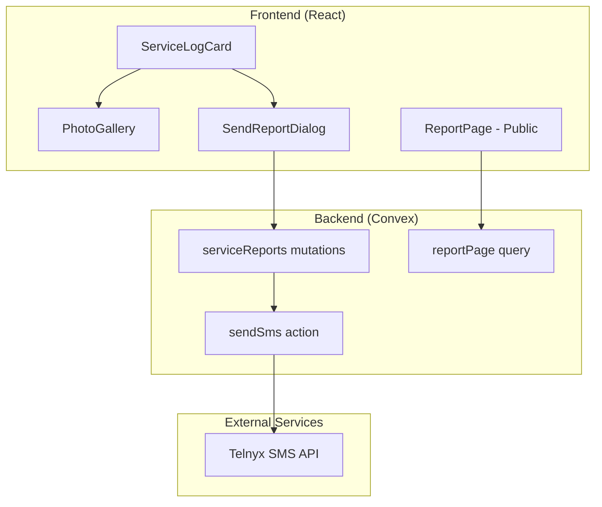

# Design Document: Customer Service Reports

## Overview

This feature adds two key capabilities to the pool service application:
1. **Photo Display in Service Log History** - Shows captured photos when viewing past service logs
2. **SMS Service Reports** - Sends service summaries with photos to customers via Telnyx SMS

The design leverages existing infrastructure (Convex backend, servicePhotos table) and adds new components for report generation, public report viewing, and SMS delivery.

## Architecture



## Components and Interfaces

### 1. Enhanced ServiceLogCard Component

Updates the existing `ServiceLogCard` to display photo indicators and a photo gallery when expanded.

```typescript
interface ServiceLogCardProps {
  log: ServiceLog;
  photos?: ServicePhoto[];  // New: photos for this log
  onDelete: () => void;
  onSendReport?: () => void;  // New: callback for send report
  reportSentAt?: string;  // New: timestamp if report was sent
}

interface ServicePhoto {
  id: string;
  url: string;
  category: 'before' | 'after';
  timestamp: string;
}
```

### 2. PhotoGallery Component

Displays photos grouped by category with lightbox support.

```typescript
interface PhotoGalleryProps {
  photos: ServicePhoto[];
  onPhotoClick?: (photo: ServicePhoto) => void;
}

// Groups photos by category and renders thumbnails
// Clicking a thumbnail opens lightbox view
```

### 3. SendReportDialog Component

Confirmation dialog for sending SMS reports.

```typescript
interface SendReportDialogProps {
  isOpen: boolean;
  onClose: () => void;
  onConfirm: () => Promise<void>;
  customerPhone: string;
  messagePreview: string;
  isLoading: boolean;
  error?: string;
}
```

### 4. Public Report Page

A publicly accessible page for customers to view their service report.

```typescript
// Route: /report/:reportId
interface ReportPageProps {
  reportId: string;
}

interface ServiceReportData {
  businessName: string;
  serviceDate: string;
  technicianName: string;
  customerName: string;
  chemicalReadings: ChemicalReadings;
  notes?: string;
  photos: ServicePhoto[];
  overallStatus: 'good' | 'needs_attention';
}
```

### 5. SMS Message Formatter

Generates the SMS message content.

```typescript
function formatSmsMessage(
  businessName: string,
  serviceDate: string,
  overallStatus: 'good' | 'needs_attention',
  reportLink: string
): string {
  // Returns message like:
  // "ChemCheck Pool Service - Service completed 12/21/2025
  // Pool Status: ✓ All Good
  // View full report with photos: https://app.example.com/report/abc123"
}
```

### 6. Phone Number Validation

Validates and normalizes phone numbers to E.164 format.

```typescript
interface PhoneValidationResult {
  isValid: boolean;
  normalized?: string;  // E.164 format: +1XXXXXXXXXX
  error?: string;
}

function validatePhoneNumber(input: string): PhoneValidationResult;
function normalizeToE164(phone: string, defaultCountry?: string): string;
```

## Data Models

### New: serviceReports Table

```typescript
// convex/schema.ts addition
serviceReports: defineTable({
  service_log_id: v.id("serviceLogs"),
  customer_id: v.id("customers"),
  report_token: v.string(),  // UUID v4, generated at record creation
  sent_at: v.optional(v.number()),  // Timestamp when SMS was sent
  sent_to_phone: v.optional(v.string()),  // Phone number SMS was sent to (E.164)
  send_count: v.optional(v.number()),  // Number of times SMS was sent (for re-sends)
  created_at: v.number(),
})
  .index("by_service_log", ["service_log_id"])
  .index("by_token", ["report_token"])  // Unique constraint enforced in mutation
```

#### Token Generation Strategy

- **Format**: UUID v4 (36 characters, 122 bits of entropy)
- **Generation**: `crypto.randomUUID()` called at report record creation
- **Uniqueness**: Enforced by checking `by_token` index before insert; collision triggers regeneration
- **Timing**: Token is generated when user first clicks "Send Report", not lazily on page access

#### Token Lifecycle Policy

- **Expiration**: Tokens do NOT expire - they remain valid indefinitely (per Requirement 3.7)
- **Revocation**: Tokens cannot be manually invalidated by users
- **Deletion Behavior**: If the underlying service log is deleted, the report record is cascade-deleted, making the token return a "Report not found" error
- **Rationale**: Customers may reference old reports for warranty claims or historical records; permanent links provide better UX

### Updated: customers Table - Phone Field Specification

The existing `phone` field (already `v.optional(v.string())`) will be used with the following validation rules:

```typescript
// Phone field validation rules (enforced in mutation, not schema)
// - Optional field: customers can exist without phone numbers
// - Storage format: E.164 (e.g., "+15551234567")
// - Validation regex: /^\+1[2-9]\d{9}$/ (US numbers only for MVP)
// - Min length: 12 characters (with +1 prefix)
// - Max length: 12 characters (US numbers)

// Migration: Existing non-normalized phone numbers will be normalized
// on next customer edit, or flagged as invalid if unparseable
```

#### Phone Validation Rules

| Input Format | Valid | Normalized Output |
|--------------|-------|-------------------|
| `555-123-4567` | ✓ | `+15551234567` |
| `(555) 123-4567` | ✓ | `+15551234567` |
| `5551234567` | ✓ | `+15551234567` |
| `+1 555 123 4567` | ✓ | `+15551234567` |
| `1-555-123-4567` | ✓ | `+15551234567` |
| `123-4567` | ✗ | Error: incomplete |
| `555-123-456` | ✗ | Error: invalid length |

## Correctness Properties

*A property is a characteristic or behavior that should hold true across all valid executions of a system—essentially, a formal statement about what the system should do. Properties serve as the bridge between human-readable specifications and machine-verifiable correctness guarantees.*

### Property 1: Photo count indicator accuracy
*For any* service log with N associated photos (where N > 0), the ServiceLogCard SHALL display a photo indicator showing exactly N photos, with correct counts for before and after categories.
**Validates: Requirements 1.1, 1.5**

### Property 2: Photo gallery grouping
*For any* set of photos with mixed categories, the PhotoGallery SHALL render all photos grouped by category (before photos together, after photos together) with each group clearly labeled.
**Validates: Requirements 1.2, 1.3**

### Property 3: SMS message content completeness
*For any* service log, the generated SMS message preview SHALL contain: the business name, the service date, the overall pool status indicator, and a valid report link URL.
**Validates: Requirements 2.2, 2.3**

### Property 4: Report link uniqueness
*For any* two distinct service logs, the generated report tokens SHALL be unique (no collisions).
**Validates: Requirements 2.4**

### Property 5: Report link reuse on re-send
*For any* service log that has already been sent as a report, re-sending SHALL use the same report_token (and thus the same URL) as the original send.
**Validates: Requirements 5.3**

### Property 6: Phone number validation and normalization
*For any* valid phone number input (US format with or without country code, with various separators), the validation function SHALL return isValid=true and the normalized field SHALL be in E.164 format (+1XXXXXXXXXX).
**Validates: Requirements 4.4, 4.5**

### Property 7: Report page content completeness
*For any* valid report token, the public report page SHALL display: service date, technician name, all chemical readings with status indicators, any notes (if present), and all photos grouped by category.
**Validates: Requirements 3.2, 3.3, 3.4, 3.5**

### Property 8: Report sent indicator accuracy
*For any* service log with a sent report, the ServiceLogCard SHALL display a "Report Sent" indicator showing the correct sent date.
**Validates: Requirements 5.1**

## Error Handling

### SMS Sending Errors

| Error Type | User Message | Recovery Action |
|------------|--------------|-----------------|
| No phone number | "No phone number on file. Please add a phone number to send reports." | Link to edit customer |
| Invalid phone format | "Invalid phone number format. Please update the customer's phone number." | Link to edit customer |
| Telnyx API error | "Failed to send SMS: {error message}" | Retry button |
| Network error | "Network error. Please check your connection and try again." | Retry button |

### Report Page Errors

| Error Type | User Message |
|------------|--------------|
| Invalid/expired token | "Report not found. The link may be invalid." |
| Service log deleted | "This service report is no longer available." |

### Idempotency and Duplicate-Send Handling

#### Send Operation Idempotency

The send report operation is designed to be **idempotent within a short window**:

1. **Duplicate Click Prevention**: The SendReportDialog disables the confirm button immediately on click and shows a loading state. This prevents accidental double-clicks.

2. **Database-First Pattern**: The mutation follows this order:
   ```
   1. Check if report record exists (by service_log_id)
   2. If exists and sent_at is within last 60 seconds → return existing record (no SMS)
   3. If exists and sent_at is older → send SMS, update sent_at and increment send_count
   4. If not exists → create record, send SMS, set sent_at
   ```

3. **Re-send Behavior**: When re-sending a report:
   - Same report_token is used (URL doesn't change)
   - Same SMS message content is sent (identical to original)
   - `send_count` is incremented for audit purposes
   - Customer receives a new SMS with the same link

#### Failure Recovery

| Failure Point | Behavior | Recovery |
|---------------|----------|----------|
| SMS succeeds, DB write fails | SMS is sent but report not marked as sent | User can retry; duplicate SMS is acceptable |
| DB write succeeds, SMS fails | Report record exists with no sent_at | User sees error, can retry; SMS will be sent |
| Both fail | No record created | User sees error, can retry from scratch |

**Design Decision**: We prioritize "at-least-once" delivery over "exactly-once" because:
- Receiving a duplicate service report SMS is a minor inconvenience
- Missing a report entirely is a worse customer experience
- Telnyx charges per message, but duplicate sends are rare edge cases

## Testing Strategy

### Unit Tests
- Phone number validation with various input formats
- SMS message formatting
- Photo grouping logic
- Report token generation

### Property-Based Tests
- Property 1: Photo count accuracy across random photo counts
- Property 2: Photo grouping with random category distributions
- Property 3: SMS content with random service log data
- Property 4: Token uniqueness across many generated tokens
- Property 5: Token reuse verification
- Property 6: Phone validation with generated phone formats
- Property 7: Report page content with random service data
- Property 8: Sent indicator with random timestamps

### Integration Tests
- End-to-end SMS sending flow (with Telnyx mock)
- Public report page rendering
- ServiceLogCard with photos

### Testing Framework
- Vitest for unit and property tests
- fast-check for property-based testing
- React Testing Library for component tests

## Telnyx Integration

### Configuration

```typescript
// Environment variables
TELNYX_API_KEY=KEY...
TELNYX_MESSAGING_PROFILE_ID=...
TELNYX_FROM_NUMBER=+1XXXXXXXXXX
```

### Send SMS Action (Convex)

```typescript
// convex/sms.ts
import Telnyx from 'telnyx';

export const sendSms = action({
  args: {
    to: v.string(),  // E.164 format
    message: v.string(),
  },
  handler: async (ctx, args) => {
    const telnyx = new Telnyx(process.env.TELNYX_API_KEY);
    
    const response = await telnyx.messages.create({
      from: process.env.TELNYX_FROM_NUMBER,
      to: args.to,
      text: args.message,
      messaging_profile_id: process.env.TELNYX_MESSAGING_PROFILE_ID,
    });
    
    return {
      success: true,
      messageId: response.data.id,
    };
  },
});
```

## Security Considerations

1. **Report Token Security**: 
   - Use UUID v4 (122 bits of entropy) generated via `crypto.randomUUID()`
   - Tokens are unguessable but not encrypted
   - No token expiration (permanent links per requirements)
   
2. **Rate Limiting**: 
   - Limit SMS sends to 5 per customer per day
   - 60-second cooldown between sends to same customer
   - Prevents abuse and accidental duplicate sends
   
3. **Phone Number Privacy**: 
   - Only show last 4 digits in confirmation dialog (e.g., "•••• •••• 4567")
   - Full number stored in E.164 format in database
   
4. **Public Report Access**: 
   - Reports are intentionally public (no auth) for customer convenience
   - Security relies on unguessable tokens (122-bit entropy)
   - No sensitive PII exposed on report page (no phone numbers, no addresses)
