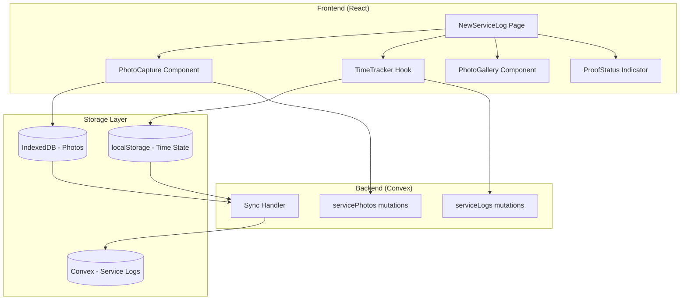

# Design Document: Proof of Service

## Overview

The Proof of Service feature adds photo documentation and automatic time tracking to the existing service log workflow. This design extends the current `serviceLogs` table schema, adds new UI components for photo capture and time display, and implements offline-first data persistence using IndexedDB for photos and localStorage for time tracking state.

The implementation follows a progressive enhancement approach - the core service log functionality remains unchanged, with proof-of-service features layered on top as optional enhancements that can be required via business settings.

## Architecture



## Components and Interfaces

### 1. PhotoCapture Component

A React component that handles camera access, photo capture, and metadata attachment.

```typescript
interface PhotoCaptureProps {
  serviceLogId: string | null;  // null for new logs
  category: 'before' | 'after';
  onPhotoCapture: (photo: CapturedPhoto) => void;
  disabled?: boolean;
}

interface CapturedPhoto {
  id: string;
  dataUrl: string;           // Base64 encoded image
  timestamp: string;         // ISO 8601 format
  category: 'before' | 'after';
  location: GeoLocation | null;
}

interface GeoLocation {
  latitude: number;
  longitude: number;
  accuracy: number;          // meters
  address?: string;          // reverse geocoded address
}
```

### 2. TimeTracker Hook

A custom React hook that manages automatic time tracking for service visits.

```typescript
interface TimeTrackerState {
  startTime: string | null;   // ISO 8601 UTC
  endTime: string | null;     // ISO 8601 UTC
  duration: number | null;    // milliseconds
  isTracking: boolean;
}

interface UseTimeTrackerReturn {
  state: TimeTrackerState;
  startTracking: () => void;
  stopTracking: () => void;
  getDurationDisplay: () => string;  // "45 min" or "1h 23min"
}

function useTimeTracker(customerId: string): UseTimeTrackerReturn;
```

### 3. PhotoGallery Component

Displays captured photos with metadata overlay.

```typescript
interface PhotoGalleryProps {
  photos: CapturedPhoto[];
  onDelete?: (photoId: string) => void;
  readOnly?: boolean;
}
```

### 4. ProofStatus Indicator

Shows proof-of-service completion status on service log cards.

```typescript
interface ProofStatusProps {
  hasPhotos: boolean;
  photoCount: number;
  hasTimeTracking: boolean;
  duration?: number;
  syncStatus: 'synced' | 'pending' | 'failed';
}
```

### 5. Offline Storage Service

Manages IndexedDB for photos and localStorage for time tracking.

```typescript
interface OfflineStorageService {
  // Photo operations
  savePhoto(photo: CapturedPhoto, customerId: string): Promise<string>;
  getPhotos(customerId: string): Promise<CapturedPhoto[]>;
  deletePhoto(photoId: string): Promise<void>;
  
  // Time tracking operations
  saveTimeState(customerId: string, state: TimeTrackerState): void;
  getTimeState(customerId: string): TimeTrackerState | null;
  clearTimeState(customerId: string): void;
  
  // Sync operations
  getPendingSync(): Promise<PendingSyncItem[]>;
  markSynced(itemId: string): Promise<void>;
  markFailed(itemId: string, error: string): Promise<void>;
}
```

## Data Models

### Extended Service Log Schema

```typescript
// convex/schema.ts - Extended serviceLogs table
serviceLogs: defineTable({
  // Existing fields
  customer_id: v.id("customers"),
  service_date: v.string(),
  status: v.string(),
  notes: v.optional(v.string()),
  ph: v.string(),
  chlorine: v.string(),
  alkalinity: v.string(),
  stabilizer: v.string(),
  salt: v.optional(v.number()),
  
  // New proof-of-service fields
  start_time: v.optional(v.string()),      // ISO 8601 UTC
  end_time: v.optional(v.string()),        // ISO 8601 UTC
  duration_ms: v.optional(v.number()),     // Calculated duration
  photo_count: v.optional(v.number()),     // Count of attached photos
  has_before_photos: v.optional(v.boolean()),
  has_after_photos: v.optional(v.boolean()),
})

// New servicePhotos table
servicePhotos: defineTable({
  service_log_id: v.id("serviceLogs"),
  customer_id: v.id("customers"),
  category: v.string(),                    // 'before' | 'after'
  storage_id: v.id("_storage"),            // Convex file storage
  timestamp: v.string(),                   // ISO 8601 UTC
  latitude: v.optional(v.number()),
  longitude: v.optional(v.number()),
  accuracy: v.optional(v.number()),
  address: v.optional(v.string()),
  created_at: v.number(),
})
  .index("by_service_log", ["service_log_id"])
  .index("by_customer", ["customer_id"])
```

### IndexedDB Schema (Offline Photos)

```typescript
interface OfflinePhotoRecord {
  id: string;                    // UUID
  customerId: string;
  serviceLogId: string | null;   // null until service log created
  category: 'before' | 'after';
  dataUrl: string;               // Base64 image data
  timestamp: string;             // ISO 8601
  latitude: number | null;
  longitude: number | null;
  accuracy: number | null;
  syncStatus: 'pending' | 'synced' | 'failed';
  syncError?: string;
  createdAt: number;
}
```

### localStorage Schema (Time Tracking)

```typescript
// Key: `timeTracker_${customerId}`
interface StoredTimeState {
  customerId: string;
  startTime: string;           // ISO 8601 UTC
  endTime: string | null;
  lastUpdated: number;         // timestamp for cleanup
}
```

## Correctness Properties

*A property is a characteristic or behavior that should hold true across all valid executions of a system—essentially, a formal statement about what the system should do. Properties serve as the bridge between human-readable specifications and machine-verifiable correctness guarantees.*

### Property 1: Photo Metadata Completeness

*For any* captured photo, the photo record SHALL contain a valid id, dataUrl, timestamp in ISO 8601 format, and category ('before' or 'after'). Location fields may be null but must be present.

**Validates: Requirements 1.2, 2.1**

### Property 2: Timestamp Validation

*For any* photo stored with a service log, the photo timestamp SHALL be within 24 hours of the service date. Photos with timestamps outside this range SHALL be rejected.

**Validates: Requirements 2.2**

### Property 3: Photo Persistence Round-Trip

*For any* captured photo, saving to storage and then retrieving SHALL return an equivalent photo object with all metadata intact.

**Validates: Requirements 1.5, 6.1**

### Property 4: Multiple Photos Per Category

*For any* service log, the system SHALL accept and store any number of photos (0 to N) for each category (before/after) without data loss.

**Validates: Requirements 1.6**

### Property 5: Time Tracking Duration Calculation

*For any* service visit with valid start and end times, the calculated duration SHALL equal (endTime - startTime) in milliseconds, and SHALL be non-negative.

**Validates: Requirements 3.3**

### Property 6: Time Storage in UTC

*For any* stored time value, the time SHALL be in UTC format. When displayed, it SHALL be converted to the user's local timezone.

**Validates: Requirements 3.6**

### Property 7: Service Summary Completeness

*For any* completed service log, the generated summary SHALL contain all required fields: customer name, service date, start time, end time, duration, photo count, and chemical readings.

**Validates: Requirements 4.2, 4.5**

### Property 8: Requirement Enforcement

*For any* service log where business settings require photos, attempting to complete the service without photos SHALL be rejected with an appropriate error message.

**Validates: Requirements 5.2, 5.4**

### Property 9: Proof-of-Service Filter Accuracy

*For any* filter query on service logs by proof-of-service completeness, the returned logs SHALL match the filter criteria (has photos, has time tracking).

**Validates: Requirements 4.4**

### Property 10: Sync Status Accuracy

*For any* service log with offline data, the sync status SHALL accurately reflect the current state: 'synced' if all data uploaded, 'pending' if upload in progress or queued, 'failed' if upload failed.

**Validates: Requirements 6.4**

### Property 11: Photo Metadata Immutability

*For any* photo after initial capture and storage, attempts to modify the timestamp, location, or category SHALL be rejected.

**Validates: Requirements 2.4**

## Error Handling

### Camera Access Errors

- **Permission Denied**: Show user-friendly message with instructions to enable camera in settings
- **No Camera Available**: Disable photo capture, show message suggesting desktop upload alternative
- **Camera In Use**: Retry with exponential backoff, show "Camera busy" message

### Geolocation Errors

- **Permission Denied**: Continue without location, mark as "Location unavailable"
- **Position Unavailable**: Retry once, then continue without location
- **Timeout**: Use last known position if available, otherwise continue without

### Storage Errors

- **IndexedDB Full**: Alert user, suggest clearing old photos, prevent new captures
- **Quota Exceeded**: Compress images, remove oldest synced photos
- **Sync Failed**: Queue for retry, show pending indicator, allow manual retry

### Time Tracking Errors

- **App Crash/Close**: Preserve start time in localStorage, prompt for manual end time on next open
- **Clock Skew**: Validate times are reasonable (not in future, not more than 24h ago)

## Testing Strategy

### Unit Tests

Unit tests will verify specific examples and edge cases:

- Photo metadata validation with various input combinations
- Time duration calculation with edge cases (same start/end, midnight crossing)
- Sync status determination logic
- Filter query matching
- Error message generation for missing requirements

### Property-Based Tests

Property-based tests will verify universal properties using fast-check:

- **Photo Metadata Completeness**: Generate random photo data, verify all required fields present
- **Timestamp Validation**: Generate random timestamps and service dates, verify validation logic
- **Duration Calculation**: Generate random start/end times, verify duration = end - start
- **Round-Trip Persistence**: Generate photos, save/load, verify equivalence
- **Filter Accuracy**: Generate service logs with various proof states, verify filter results

### Integration Tests

- Full photo capture flow with mocked camera API
- Time tracking across component lifecycle
- Offline storage and sync flow
- Business settings enforcement

### Test Configuration

- Property tests: minimum 100 iterations per property
- Use fast-check for property-based testing
- Mock browser APIs (camera, geolocation, IndexedDB) for deterministic tests
